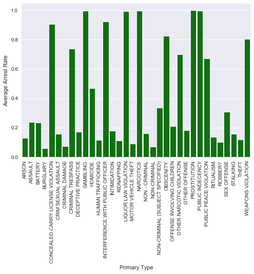

## Feature Analysis

The following features are included in the original data set : 

* **ID** : unique identifier for each record
* **Case Number** : The Chicago Police Depart RD (Records Division) Number
* **Date** : the date the incident ~supposedly~ occurred
* **Block** : a partially redacted address where the incident occurred, placing it on the same block as the incident
* **IUCR** : Illinois Uniform Crime Reporting Code. This describes both the primary type of the incident and secondary description. See the full list of IUCR codes here 
* **Primary Type** : the primary description of the IUCR code
* **Description** : the secondary description of the IUCR code
* **Location Description** : description of the location where the incident occurred. Ex : STREET, APARTMENT, etc
* **Arrest** : Whether or not an arrest was made. This is the output of our logistic regression model.
* **Domestic** : indicates whether or not the incident was domestic-related
* **Beat** : indicates the beat where the incident occurred. A beat is an area of Chicago assigned to a single patrolling police car. See a full map of the beats of Chicago here
* **District** : indicates the police district where the incident occurred. See a full map of the police districts of Chicago here
* **Ward** : indicates the city council district where the incident occurred. See a full map of the wards of Chicago here
* **Community Area** : indicates in which of Chicago’s 77 community areas the incident occurred. See a full map of the community area of Chicago here
* **FBI Code** : indicates the crime classification as outlined by the FBI’s National Incident-Based Reporting System
* **X Coordinate** : the x coordinate of the location (partially redacted) of the incident
* **Y Coordinate** : the y coordinate of the location (partially redacted) of the incident
* **Year** : the year the incident occurred
* **Updated on** : the date and time the record was last updated in the database
* **Latitude** : the latitude of the partially redacted location of the incident
* **Longitude** : the longitude of the partially redacted location of the incident 
* **Location** : the partially redacted location of the incident in a format suitable for mapping

Obviously, we do not want to include all features in our final model. Thus, to get a sense of what features actually affect the arret rate, we made some initial plots as shown below. Below each plot is a brief summary of what it tells us about the relation ship between data. 

# Initial Plots #

