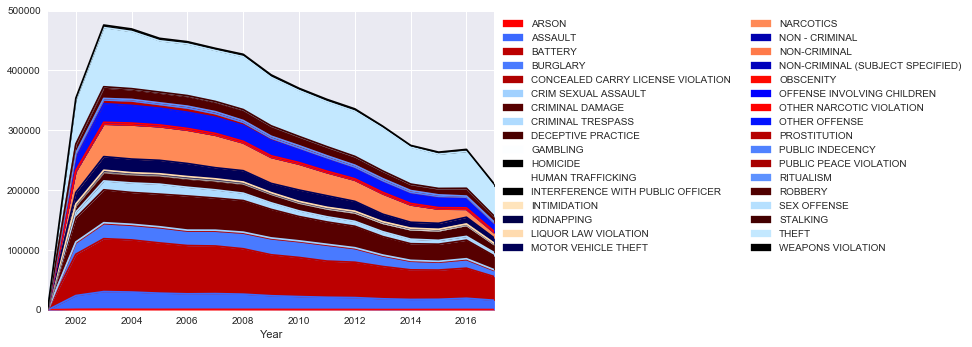
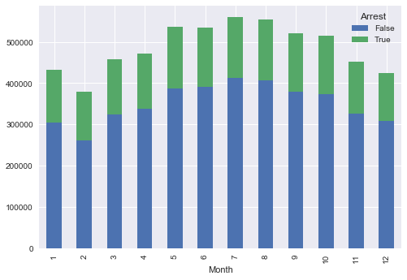
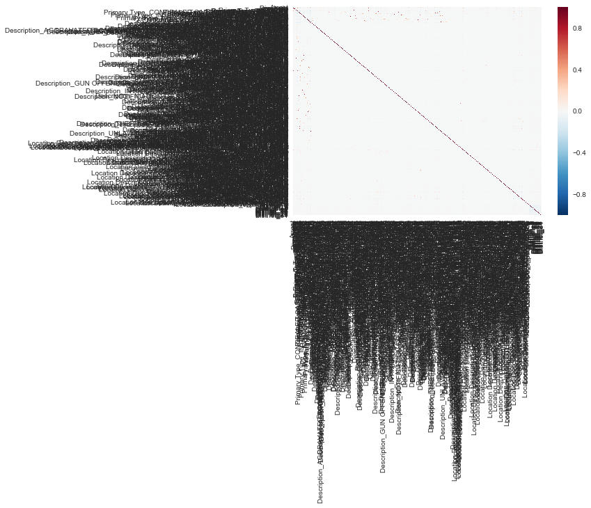

# ORIE 4741 Midterm Project Report

## Authors

- Reuben Rappaport (rbr76)
- Celine Brass (cjb57)
- Bridget Cheng (bjc267)

## Introduction
We set out to predict the probability of an arrest being made for a crime ocurring at a given time and place in the city of Chicago. Chicago, with its famously high crime rate, and heavy municipal investment in making its data available online is a natural target for analysis of police efficacy. We used the CLEAR dataset, listing all reported crimes from 2001 until the present day (with the exception of murder) to build our model.

This sort of analysis could lead to insights into deficiencies in policing - perhaps certain areas of the city are systematically under-policed or certain types of crime are systematically under-investigated. Analyzing the nature and features of crimes committed in the past to identify these biases will allow us to improve the dispatchment of our police force and procedures for handling specific types of crime in the future.

## Feature Analysis

The following 22 features are included in the original data set :

* **Arrest** : Whether or not an arrest was made. _This is the output of our logistic regression model._ 

* **ID** : unique identifier for each record
* **Case Number** : The Chicago Police Depart RD (Records Division) Number
* **Date** : the date the incident supposedly occurred
* **Block** : a partially redacted address where the incident occurred, placing it on the same block as the incident
* **IUCR** : Illinois Uniform Crime Reporting Code. This describes both the primary type of the incident and secondary description. See the full list of IUCR codes here
* **Primary Type** : the primary description of the IUCR code
* **Description** : the secondary description of the IUCR code
* **Location Description** : description of the location where the incident occurred. Ex : STREET, APARTMENT, etc
* **Domestic** : indicates whether or not the incident was domestic-related
* **Beat** : indicates the beat where the incident occurred. A beat is an area of Chicago assigned to a single patrolling police car. See a full map of the beats of Chicago here
* **District** : indicates the police district where the incident occurred. See a full map of the police districts of Chicago here
* **Ward** : indicates the city council district where the incident occurred. See a full map of the wards of Chicago here
* **Community Area** : indicates in which of Chicago’s 77 community areas the incident occurred. See a full map of the community area of Chicago here
* **FBI Code** : indicates the crime classification as outlined by the FBI’s National Incident-Based Reporting System
* **X Coordinate** : the x coordinate of the location (partially redacted) of the incident
* **Y Coordinate** : the y coordinate of the location (partially redacted) of the incident
* **Year** : the year the incident occurred
* **Updated on** : the date and time the record was last updated in the database
* **Latitude** : the latitude of the partially redacted location of the incident
* **Longitude** : the longitude of the partially redacted location of the incident
* **Location** : the partially redacted location of the incident in a format suitable for mapping

Obviously, we do not want to include all features in our final model. Thus, to get a sense of what features actually affect the arrest rate, we made some initial plots as shown below. Below each plot is a brief summary of what it tells us about the relationship between features.

# Initial Plots



This plot shows total crime over time, where each color corresponds to a type of crime. You can see that crimes like theft, battery, and criminal damage are very common as compared to other types, however, as a whole crime has drastically decreased in Chicago over the past 15 years. 


This plot gives the average arrest rate of each primary crime type. One can see there are several crimes whose average arrest rate is 1. This is because in the case of crimes like gambling or prostitution, the crime is really only ever reported by the police officer making the arrest. Thus, we eventually ended up leaving out crimes like this as it did not make sense to include them in our model. 


The plot above shows the total number of crimes reported and arrests made during each hour of the day. One can see these rates vary widely by hour, thus we decided hour is a valuable feature to include. 


The above plot shows that the day of the week really has no effect on crime and arrests. Though we were surprised by this graph, it convinced us to not include the day of the week in our model. 


The above plot shows that the day of the meek really has no effect on crime and arrests. This graph convinced us to not include the day of the week in our model. 



This graph shows how total crime reported and arrests vary by month. What is surprising about this graph is there is a noticeable increase in crime reported during the summer months, however, there is no corresponding increase in arrests. Thus, month was included as a feature in our final model. 


This graph shows that average arrest rate varies widely by police district. Since there is such a large variance in this data, we included this feature in our final model.


This graph shows that ward experiences similar variety in arrest rate as police district, however, because there are so many wards, we decided we would initially use police districts in our model. 

## Model Selection
A problem with many predictive models is that they apply an absolute prediction to each sample. However it is not the case that a crime of a given type committed at a given time and place will deterministically result in an arrest or not. It is perfectly possible for nearly identical crimes to have different outcomes. Based on this structure we wanted to predict the _probability_ that a crime with certain features would lead to an arrest. A natural model to perform this translation between binary outcomes and statistical probabilities is Logistic Regression, so we utilized the python SKLearn library to calculate an initial Logistic Regression model.

For a Logistic Regression all features must be independent binary numeric variables. This influenced our choices during the data cleaning and feature engineering stage of model construction.

To avoid underfitting, we attempted to remove features that were useless while generating new features that would provide predictive power (see the Feature Engineering section). To avoid overfitting we made sure to use a _massive_ dataset while limiting the possible complexity of our model. It would quite flatly not be possible for a Logistic Regression to memorize this much data.

## Feature Engineering and Data Cleaning
Using the initial data visualizations, we were able to identify which features we believed would be informative to our model. Of the original 22 features present, we chose to completely discard the following features from the dataset: ID, Case Number, IUCR, Block, Beat, Ward, FBI Code, Updated On, X_Coordinate, Y_Coordinate, Longitude, Latitude, and Location.

Of the features only the location related ones had any missing values at all. The Location Description feature had 2828 missing values while District had only 49. The Community Area feature had a whopping 616030 missing values, by far the most of any feature we actually plan to use. However the dataset itself is so large that this is still only a tiny percentage of all samples and poses little problem.

The ID, Case Number, and Updated On features provide no descriptive information about the crime, so they were dropped. Because the IUCR is a numeric encoding of both the Primary Type and Description features, we decided to remove the single IUCR feature in favor of the two distinct categorical features. Since Block, X Coordinate, Y Coordinate, Longitude, Latitude, and Location values are extremely specific location-based values, (there were upwards of 849,571 unique values for Location), it is unlikely that a model would be able to draw useful information from these features, thus they were also dropped. We predicted that because of the variable nature of crime and policing, the beats of Chicago would have shifted over the years, thus lowering the predictive power of beat. We dropped it as a variable in favor of district, which we felt would have remained more constant. The Ward feature neither reflects the social and demographic features nor the policing activity of an area, so we chose to drop this as well.

This left us with the following features: Primary Type, Description, Date, Location Description, Arrest, Domestic, Community Area, and District. Both Community Area and District encode geographic location, so to maintain independence of features in our preliminary model, we chose to work only with District and drop Community Area. We will explore the effects of using Community Area in future models, as described in the Going Forward section.

Of these remaining features, Arrest and Domestic were already binary valued, and did not require any feature engineering. The boolean true and false values of the Arrest and Domestic features were simply transformed to be binary 0 and 1 values.

To address the Date feature, the first step we took was to segment the string value into two new features, Hour and Month. We chose to disregard the Day of Month and Day of Week features initially used in the visualizations, as we saw the distribution of arrests was almost uniform over days of the month and days of the week. Furthermore, because representing hour and month as integers does not represent the cyclic nature of these values, we cleverly applied a sine and cosine transformation function to the values, so that the closeness of values like 0 and 23 in the hours of a day is captured despite a large numerical difference. This introduced four new features, Sin Hour, Cos Hour, Sin Month, and Cos Month. We removed the original Date feature as a final step.

Primary Type, Description, Location Description, and District were categorical features and needed processing to be represented in the dataset as quantitative binary values. To do this, we utilized one-hot encodings for each value that the categorical feature took on. This process, known as creating dummy variables, indicates the presence or absence of a categorical effect. For example, for each of the possible Primary Type values, “Robbery”, “Prostitution”, “Ritualism”, etc., a new feature “Primary_Type_Robbery”, “Primary_Type_Prostitution”, “Primary_Type_Ritualism”, etc. was introduced with a value of 0 or 1 depending on the value of the original Primary Type feature. After the introduction of these dummy variable features, we removed the original Primary Type, Description, Location Description, and District features as a final step.

To limit the size of our data, we decided to use only reports that have taken place in the last 5 years--this left only crimes reported between the years of 2013-present day. Furthermore, we noticed from our visualizations that crimes of particular Primary Type values had arrest rates of nearly 1--we immediately attributed this to the fact that certain crimes would only be reported if an arrest were definitely going to be made, for example, liquor law violations or public indecency violations. We manually inspected the various Primary Type values, and ultimately chose to remove crimes with Primary Type of Gambling, Liquor Law Violation, Prostitution, Narcotics, and Public Indecency.

After this feature engineering and data processing, we were left with 9,324,840 data samples and 469 features. To make sure that all the features we had generated were linearly independent we created a heatmap or the correlation between variables. To our delight, there was a strong visible line down the diagonal with little concentration elsewhere. This means our variables are largely independent. 



## Preliminary Results
After cleaning up the dataset and running all the feature transformations we split the data 80:20 and trained a logistic regression model. Our preliminary results were quite encouraging!

```
              precision    recall    f1-score    support
          0        0.89      0.98        0.93     154420
          1        0.80      0.41        0.54      32077
avg / total        0.87      0.88        0.86     186497
```

Overall the model was quite accurate with a high average score. On average, our model was able to predict whether an arrest was made 88% of the time! Its precision and recall were excellent on crimes without an arrest. However due to the dearth of arrests in the sample (there are almost five times as many non-arrests  as arrests!) the classifier has extremely poor recall on crimes with an arrest. This is something of a fundamental structural problem in the dataset since the majority of crime reports do not end with an arrest. We’ll need to take steps to address it going forward.

## Going Forward
Although the model we trained did very well on negative examples, it had poor recall on positive examples due to their serious underrepresentation in the dataset. Our next step is going to be to look into more sophisticated sampling techniques we could use to counteract this. We’re thinking of possibly using stratified sampling to place an outsized emphasis on positive samples relative to their actual incidence. Another way to get more arrests in the dataset is to
simply include more years worth of crime.

We're also considering incorporating a new feature to replace the Month feature that we generated. Using the Day of the Year (from 0 to 365) should exhibit the same seasonal trends but at a finer granularity with (hopefully!) more predictive power. Similarly, we're considering the effect of using Community Area as a feature rather than District.

One key advantage provided by the CLEAR dataset is that it's being continuously updated as more crimes occur. Our plan is to download the new data added since we started at the end of the semester and test our model on that as a final indicator of its accuracy.
